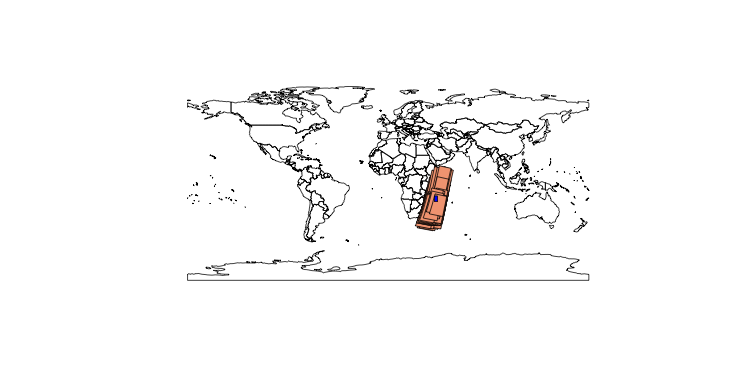

# rOpenSearch

<div><a href='http://dx.doi.org/10.5281/zenodo.10642'></a></div>


R interface to OpenSearch

### Documentation

The rOpenSearch documentation is live at: http://terradue.github.io/rOpenSearch/

The rOpenSearch documentation source is available at: https://github.com/Terradue/rOpenSearch/tree/master/src/main/doc

Inside R, use ?_<function name>_ to view the function's help page. Example:

```coffee
?GetOSQueryables
```

### Citing this package

To cite rOpenSearch use its [DOI](http://dx.doi.org/10.5281/zenodo.10642) 

### Installing a release

The releases are available at: https://github.com/Terradue/rOpenSearch/releases

Releases can be installed using [devtools](http://www.rstudio.com/products/rpackages/devtools/)

Start an R session and run:

```coffee
install_url("https://github.com/Terradue/rOpenSearch/releases/download/v0.1-SNAPSHOT/rOpenSearch_0.1.0.tar.gz")
library(rOpenSearch)
```

> Note the example above install the v0.1-SNAPSHOT release, adapt it to the current release

### Building and installing the development version

The rOpenSearch package is built using maven.

From a terminal: 

```bash
cd
git clone git@github.com:Terradue/rOpenSearch.git
cd rOpenSearch
mvn compile
```

That generates a compressed archive with the rOpenSearch package in:

```
~/rOpenSearch/target/R/src/rOpenSearch_x.y.z.tar.gz
```
To install the package, start an R session and run:

```coffee
install.packages("~/rOpenSearch/target/R/src/rOpenSearch_x.y.z.tar.gz", repos=NULL, type="source")
```

> Note x.y.z is the development version number.

Then load the library:

```coffee
library(rOpenSearch)
```

## Getting Started 

### Get Envisat MERIS Earth Observation data best coverage for the white shark habitat analysis

This example:

* Queries the [Global Biodiversity Information Facility](http://www.gbif.org/dF) using the [rOpenSci](http://ropensci.org/) [rgbif](http://ropensci.org/tutorials/rgbif_tutorial.html) package for the White Shark occurrences
* Uses the [DBSCAN clustering algorithm](http://en.wikipedia.org/wiki/DBSCAN) to identify geospatial clusters 
* Uses those clusters to query the [European Space Agency](http://www.esa.int/ESA) Envisat MERIS Full Resolution Level 1 OpenSearch catalogue
* Selects the best covered cluster

```coffee
library("devtools")
library("rgbif")
library("fpc")
library("httr")
library("stringr")
library("XML")
library("RCurl")
library("sp")
library("rgeos") 
library("maps") 
library("RColorBrewer")
library("rworldmap")
library("rOpenSearch")

install_github("ropensci/rgbif")
library("rgbif")

# set the catalogue and retrieve the queryables
osd.description <- 'http://grid-eo-catalog.esrin.esa.int/catalogue/gpod/MER_FRS_1P/description'
response.type <- "application/rdf+xml"
q <- GetOSQueryables(osd.description, response.type)
q$value[q$type == "count"] <- 200
  
# get the occurrences from GBIF using rgbif
key <- name_backbone(name='Carcharodon carcharias', kingdom='animalia')$speciesKey
occ <- occ_search(taxonKey=key, limit=1000, return='data', hasCoordinate=TRUE)
occ <- occ[complete.cases(occ),]
# bind the lon/lat columns
occ <- cbind(occ$decimalLongitude, occ$decimalLatitude)

### dbscan clustering 
eps <- 5
minpts <- 20
ds <- dbscan(occ, eps=eps, MinPts=minpts)


dataset <- list()
mbr <- list()
sp <- list()

# query the catalog using the geometry of the minimum bounding box for each cluster 
for(i in 1:max(ds$cluster)) {
  
  print(paste("Dealing with cluster", i))
  
  # get the cluster i
  cl <- (occ[ds$cluster %in% i,])
  
  # create the matrix with the cluster minimum bounding box
  coords <- matrix(nrow=5, ncol=2, byrow=TRUE, data=c(
    min(cl[,1]), min(cl[,2]), 
    max(cl[,1]), min(cl[,2]), 
    max(cl[,1]), max(cl[,2]), 
    min(cl[,1]), max(cl[,2]), 
    min(cl[,1]), min(cl[,2])))
  
  # get the cluster geospatial envelope
  mbr[[i]] <- gEnvelope(SpatialPoints(coords))
  
  # update the queryables value with the WKT of the cluster envelope 
  q$value[q$type == "geo:geometry"] <- writeWKT(gEnvelope(SpatialPoints(coords)))
  
  # query the catalogue
  res <- Query(osd.description, response.type, q)
  
  # from the result, get the Datasets
  dataset[[i]] <- xmlToDataFrame(nodes = getNodeSet(xmlParse(res), 
    "//dclite4g:DataSet"), stringsAsFactors = FALSE)
  
  # create the SpatialPolygonDataFrame
  # add the first element  
  poly.sp <- SpatialPolygonsDataFrame(readWKT(data.frame(dataset[[i]]$spatial)[1,]), dataset[[i]][1,])
  # bind the remaining elements
  for (n in 2:nrow(dataset[[i]])) {
    poly.sp <- rbind(poly.sp, SpatialPolygonsDataFrame(readWKT(data.frame(dataset[[i]]$spatial)[n,],id=n), dataset[[i]][n,]))  
  } 
  
  # evaluate the coverage index between each MERIS product and the cluster area
  for (n in 1:nrow(dataset[[i]])) {
    poly.sp[n,"coverage_index"] <- gArea(gIntersection(mbr[[i]], poly.sp[n,])) / gArea(mbr[[i]]) 
  }

  # take the MERIS products with more than 80% coverage index
  sp[[i]] <- poly.sp[poly.sp$coverage_index > 0.8,]
}

# what's the cluster with the best coverage?
index <- which.max(lapply(sp, function(x) nrow(x)))

# do a plot
newmap <- getMap() #resolution = "low")
plot(newmap)
plot(sp[[index]], add=TRUE, col=brewer.pal( 8 , "RdBu")[index])
plot(mbr[[index]], add=TRUE, col="blue")

# list the MERIS file to download from the European Space Agency
sp[[index]]$identifier
```

This returns the image below:




### Query the European Space Agency [ERS-1/2 SAR and Envisat ASAR virtual archive](http://eo-virtual-archive4.esa.int/) 

###### Query the Envisat ASAR Image Mode source packets Level 0 (ASA_IM__0P) series

Return the 100 first dataset spanning time interval 2010-01-01 to 2010-01-31

```coffee
# load the libraries
library(devtools)
library(rgdal)
library(rgeos)

install_github("rOpenSearch", username="Terradue", subdir="/src/main/R/rOpenSearch")
library(rOpenSearch)

# define the OpenSearch description URL
osd.url <- "http://eo-virtual-archive4.esa.int/search/ASA_IM__0P/description"
response.type <- "application/rdf+xml"

# get the queryables dataframe from the OpenSearch description URL
df.params <- GetOSQueryables(osd.url, response.type)

# define the values for the queryables
df.params$value[df.params$type == "count"] <- 30 
df.params$value[df.params$type == "time:start"] <- "2010-01-01"
df.params$value[df.params$type == "time:end"] <- "2010-01-31"

# submit the query
res <- Query(osd.url, response.type, df.params)

# get the dataset
dataset <- xmlToDataFrame(nodes = getNodeSet(xmlParse(res), 
  "//dclite4g:DataSet"), stringsAsFactors = FALSE)

# create a SpatialPolygonsDataFrame with the first element of res$dataset
poly.sp <- SpatialPolygonsDataFrame(readWKT(data.frame(dataset$spatial)[1,]), dataset[1,])

# iterate through the remaining dataset
for (n in 2:nrow(dataset)) {
  poly.sp <- rbind(poly.sp,
    SpatialPolygonsDataFrame(readWKT(data.frame(dataset$spatial)[n,],id=n), dataset[n,]))
}

# write the geojson file
writeOGR(poly.sp, 'example1.geojson','dataMap', driver='GeoJSON')
```

The GeoJSON file can be see here:
https://github.com/Terradue/rOpenSearch/blob/master/src/main/R/examples/example1.geojson

## Questions, bugs, and suggestions

Please file any bugs or questions as [issues](https://github.com/Terradue/rOpenSearch/issues/new) or send in a pull request.


