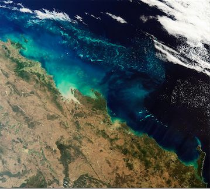

# Earth Observation & GBIF occurrences

This example:

* Queries the [Global Biodiversity Information Facility](http://www.gbif.org/) using the [rOpenSci](http://ropensci.org/) [rgbif](http://ropensci.org/tutorials/rgbif_tutorial.html) package for the White Shark occurrences
* Uses the [DBSCAN clustering algorithm](http://en.wikipedia.org/wiki/DBSCAN) to identify geospatial clusters
* Uses those clusters to query the [European Space Agency](http://www.esa.int/ESA) Envisat MERIS Full Resolution Level 1 OpenSearch catalogue to get [data](https://earth.esa.int/instruments/meris/data-app/dataprod.html#1b) about the Chlorophyll, suspended sediment and red tides of those clusters
* Selects the MERIS products covering at least 80% of the first identified cluster

 

#### Load the required packages with:

```{r warning=FALSE, error=FALSE, message=FALSE}
library("devtools")
library("rgbif")
library("fpc")
library("httr")
library("stringr")
library("XML")
library("RCurl")
library("sp")
library("rgeos")
library("maps")
library("RColorBrewer")
library("rOpenSearch")
library("rgbif")
library("knitr")
library("rworldmap")
```

#### Getting the Atlantic bluefin tuna (Thunnus thynnus) occurrences from GBIF with rgbif

```{r}
# get the occurrences from GBIF using rgbif
key <- name_backbone(name='Thunnus thynnus', kingdom='animalia')$speciesKey
occurrences <- occ_search(taxonKey=key, limit=1000, return='data', hasCoordinate=TRUE)
occurrences <- occurrences[complete.cases(occurrences),]
```

This create the data frame occ with `r nrow(occurrences)` entries. The first five entries look like:

```{r results='asis', echo=FALSE}
kable(head(occurrences, 5), format = "html")
```

The occurrences can be plotted to create the map:

```{r results='asis', message=FALSE, echo=FALSE}
gbifmap(occurrences)
```

#### Identifying geographical cluster of the occurrences

Density-based spatial clustering of applications with noise (DBSCAN) is a data clustering algorithm proposed by Martin Ester, Hans-Peter Kriegel, Jörg Sander and Xiaowei Xu in 1996. It is a density-based clustering algorithm because it finds a number of clusters starting from the estimated density distribution of corresponding nodes.
DBSCAN is one of the most common clustering algorithms and also most cited in scientific literature.

DBSCAN requires two parameters: ε (eps) and the minimum number of points required to form a dense region[a] (minPts).
It starts with an arbitrary starting point that has not been visited.
This point's ε-neighborhood is retrieved, and if it contains sufficiently many points, a cluster is started.
Otherwise, the point is labeled as noise. Note that this point might later be found in a sufficiently sized ε-environment of a different point and hence be made part of a cluster.
If a point is found to be a dense part of a cluster, its ε-neighborhood is also part of that cluster.
Hence, all points that are found within the ε-neighborhood are added, as is their own ε-neighborhood when they are also dense.
This process continues until the density-connected cluster is completely found. Then, a new unvisited point is retrieved and processed, leading to the discovery of a further cluster or noise.

We will apply the DBSCAN clustering algorithm with ε value set to 5 and minPts to 20 to identify representative occurence geospatial clusters.

```{r}
occurrences <- cbind(occurrences$decimalLongitude, occurrences$decimalLatitude)

eps <- 5
minpts <- 20
dbscan.res <- dbscan(occurrences, eps=eps, MinPts=minpts)
```

The DBSCAN algorithm identified `r max(dbscan.res$cluster)` geographical clusters.

For each cluster the minimum bounding box is identified and plot.

```{r}
mbr <- list()
plot(getMap())

#extract the minimum bounding box for each cluster
for(i in 1:max(dbscan.res$cluster)) {

 # get the cluster
 cl <- (occurrences[dbscan.res$cluster %in% i,])

 # create the matrix with the cluster minimum bounding box
 coords <- matrix(nrow=5, ncol=2, byrow=TRUE, data=c(
  min(cl[,1]), min(cl[,2]),
  max(cl[,1]), min(cl[,2]),
  max(cl[,1]), max(cl[,2]),
  min(cl[,1]), max(cl[,2]),
  min(cl[,1]), min(cl[,2])))

  # get the cluster geospatial envelope
  if (gArea(gEnvelope(SpatialPoints(coords)))>0) mbr[[length(mbr)+1]] <- gEnvelope(SpatialPoints(coords))

  plot(mbr[[length(mbr)]], add=TRUE, col="red")
}
```

#### Querying Envisat MERIS Level 1 data over a cluster

ESA hosts an OpenSearch catalogue available at: http://grid-eo-catalog.esrin.esa.int/catalogue/gpod/rdf

The MERIS Level 1 Full Resolution OpenSearch document is available at: http://grid-eo-catalog.esrin.esa.int/catalogue/gpod/MER_FRS_1P/description

```{r}
# set the catalogue and retrieve the queryables
osd.description <- 'http://grid-eo-catalog.esrin.esa.int/catalogue/gpod/MER_FRS_1P/description'
response.type <- "application/rdf+xml"
q <- GetOSQueryables(osd.description, response.type)
```

q is a data frame containing all the queryables to specify a query to the catalogue:

```{r results='asis', echo=FALSE}
kable(q, format = "html")
```

Let's set the **count** field type value to `r count <- 200; count`:

```{r}
q$value[q$type == "count"] <- count
```

set out time of interest by setting the value of the field types **time:start**, **time:end** with:

```{r}
q$value[q$type == "time:start"] <- "2006-01-01"
q$value[q$type == "time:end"] <- "2006-12-31"
```

and set the geo-spatial queryable to the Well-Known Text value of the first cluster identified:

```{r}
q$value[q$type == "geo:geometry"] <- writeWKT(mbr[[1]])
```

Our queryables data frame _q_ is now updated with (removing NAs for readability):

```{r results='asis', echo=FALSE}
kable(q[complete.cases(q),], format = "html")
```

Let's query the catalogue and apply an xpath expression to retrieve the datasets as a data frame:

```{r warning=FALSE}
res <- Query(osd.description, response.type, q)
```

From the result, get the Datasets

```{r warning=FALSE}
dataset <- xmlToDataFrame(nodes = getNodeSet(xmlParse(res), "//dclite4g:DataSet"), stringsAsFactors = FALSE)
```

Let's inspect the first datasets (showing only the **identifier** column):

```{r results='asis', echo=FALSE, warning=FALSE}
kable(head(dataset[,1], 5), format = "html")
```

We now create a SpatialPolygonsDataFrame:
```{r warning=FALSE}
poly.sp <- SpatialPolygonsDataFrame(readWKT(data.frame(dataset$spatial)[1,]), dataset[1,])

for (n in 2:nrow(dataset)) {
 poly.sp <- rbind(poly.sp, SpatialPolygonsDataFrame(readWKT(data.frame(dataset$spatial)[n,],id=n), dataset[n,]))
}
```

And check the coverage index of the MERIS products wrt the cluster minimum bounding box:

```{r warning=FALSE}
for (n in 1:nrow(dataset)) {
 poly.sp[n,"coverage_index"] <- gArea(gIntersection(mbr[[1]], poly.sp[n,])) / gArea(mbr[[1]])
}
```

Select those with a coverage over 80%:

```{r warning=FALSE}
sp <- poly.sp[poly.sp$coverage_index > 0.8,]
```

Let's plot the `r nrow(sp)` MERIS products that cover for at least 80% of the cluster area:

```{r warning=FALSE}
plot(getMap())
plot(sp, add=TRUE, col=brewer.pal(8 , "RdBu")[1])
plot(mbr[[1]], add=TRUE, col="blue")
```

#### Going further

The analysis could be repeated with the other clusters to identify what is the best cluster to work with MERIS data.
